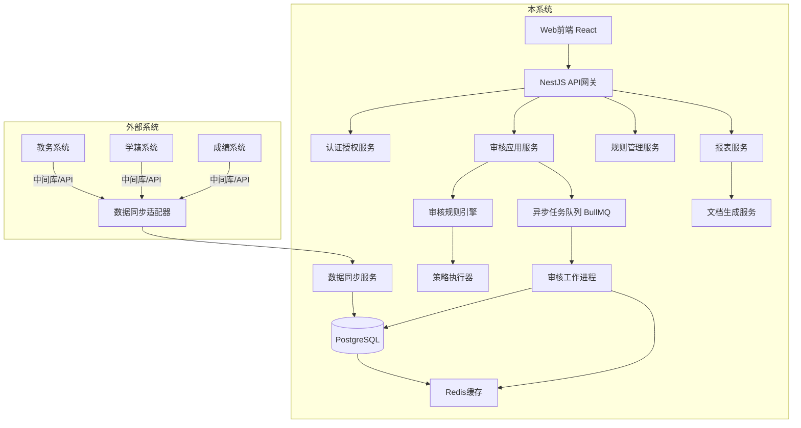

## 产品概述

"学生毕业及学位资格审查系统"是一个面向高校的多角色、高并发、规则驱动的业务系统，用于自动化审核学生毕业资格和学位授予资格。系统需对接学校现有教务系统、学籍系统、成绩系统，支持按专业/学位类型灵活配置审核规则，部署于学校内网服务器。

## 核心功能

- **多角色权限管理**：学生（查看个人审核结果）、教师（查看班级/指导学生情况）、院系负责人（本院系审核管理）、教务处管理员（全校审核管理、规则配置）
- **数据同步对接**：通过中间库/API/ETL方式对接现有教务系统，同步学生学籍、成绩、课程等基础数据
- **审核规则引擎**：按专业、学位类型（学士/硕士/博士）灵活配置毕业条件和学位授予条件，支持规则版本管理
- **资格审核流程**：自动计算学分绩点、判定课程修读情况、生成审核报告、支持人工复核与异议处理
- **报表与导出**：生成毕业资格审核表、学位授予名单、各类统计报表，支持Word/PDF导出
- **系统管理**：用户管理、角色权限、操作日志、数据备份、系统监控

## 技术栈选择

- **前端**：React 18 + TypeScript + Tailwind CSS + shadcn/ui
- **后端**：Node.js + NestJS (TypeScript) — 企业级架构，适合复杂业务规则
- **数据库**：PostgreSQL — 支持复杂查询、事务、JSON字段存储灵活规则
- **缓存**：Redis — 热点数据缓存、会话管理、审核结果缓存
- **消息队列**：BullMQ (Redis-based) — 异步审核任务、数据同步任务
- **文档生成**：使用 [skill:Word 文档生成] 生成审核报告/学位授予决定书等正式文档
- **部署**：Docker + Docker Compose，学校内网服务器部署

## 实现方案

### 架构策略

采用分层架构 + 领域驱动设计(DDD)：

- **接入层**：REST API + 数据同步适配器（对接现有系统）
- **应用层**：用例编排、审核流程控制、权限校验
- **领域层**：审核规则引擎（策略模式 + 规则链）、学生聚合、成绩聚合
- **基础设施层**：数据持久化、缓存、消息队列、文件存储

### 关键技术决策

1. **规则引擎**：自研轻量级规则引擎（基于JSON配置 + 策略模式），而非引入Drools等重型引擎。原因：高校审核规则逻辑相对固定但参数多变，自研引擎更轻量、可控、易维护。
2. **数据同步**：采用"中间库 + 定时ETL"模式。现有系统写入中间库，本系统定时拉取。原因：最小化对现有系统侵入，符合高校IT现状。
3. **审核计算**：异步任务处理。毕业季集中审核时，将审核任务放入队列，避免阻塞用户请求。
4. **高并发处理**：审核结果缓存 + 增量更新。学生成绩变动时触发增量重算，而非全量重算。

### 性能与可靠性

- 审核任务时间复杂度：O(n) 单学生审核（n为课程数），通过缓存和异步队列可支持千级并发
- 数据库优化：成绩表按学期分区索引，审核结果表按届别分区
- 等保要求：密码加密存储、操作审计日志、敏感数据脱敏、HTTPS传输、定期备份

## 架构设计



## 目录结构

```
f:/xm/SGADQRS/
├── apps/
│   ├── web/                          # [NEW] React前端应用
│   │   ├── src/
│   │   │   ├── pages/
│   │   │   │   ├── student/          # 学生端页面
│   │   │   │   ├── teacher/          # 教师端页面
│   │   │   │   ├── department/       # 院系端页面
│   │   │   │   └── admin/            # 教务处管理端页面
│   │   │   ├── components/           # 共享组件
│   │   │   ├── hooks/                # 自定义hooks
│   │   │   └── services/             # API客户端
│   │   └── package.json
│   │
│   └── server/                       # [NEW] NestJS后端服务
│       ├── src/
│       │   ├── modules/
│       │   │   ├── auth/             # 认证授权模块
│       │   │   ├── user/             # 用户管理模块
│       │   │   ├── student/          # 学生数据模块
│       │   │   ├── course/           # 课程数据模块
│       │   │   ├── grade/            # 成绩数据模块
│       │   │   ├── audit/            # 审核核心模块
│       │   │   │   ├── rules/        # 规则引擎
│       │   │   │   ├── engine/       # 审核引擎
│       │   │   │   └── tasks/        # 异步审核任务
│       │   │   ├── sync/             # 数据同步模块
│       │   │   ├── report/           # 报表模块
│       │   │   └── log/              # 操作日志模块
│       │   ├── common/               # 公共工具、拦截器、过滤器
│       │   └── main.ts
│       └── package.json
│
├── packages/
│   ├── shared-types/                 # [NEW] 共享类型定义
│   └── rule-engine/                  # [NEW] 审核规则引擎核心库
│
├── docker/
│   ├── docker-compose.yml            # [NEW] 部署编排
│   └── init-scripts/                 # [NEW] 数据库初始化脚本
│
└── docs/                             # [NEW] 项目文档
    ├── api/                          # API接口文档
    ├── deploy/                       # 部署文档
    └── rules/                        # 审核规则配置说明
```

## 关键代码结构

```typescript
// 审核规则配置接口
interface AuditRuleConfig {
  id: string;
  name: string;
  degreeType: 'bachelor' | 'master' | 'doctor';
  majorIds: string[];
  version: number;
  conditions: RuleCondition[];
  effectiveDate: Date;
}

// 审核结果接口
interface AuditResult {
  studentId: string;
  auditType: 'graduation' | 'degree';
  status: 'passed' | 'failed' | 'pending';
  details: AuditDetail[];
  calculatedAt: Date;
}

// 规则执行上下文
interface RuleContext {
  student: StudentProfile;
  grades: CourseGrade[];
  rules: AuditRuleConfig;
}
```

## 设计风格

采用**现代政务/教育管理系统风格**——专业、清晰、高效。以浅色调为主，搭配沉稳的蓝色系，营造权威可信赖的视觉感受。界面布局遵循"信息密度高但层次分明"的原则，适合大量表格、表单的审核业务场景。

### 页面规划（核心页面）

1. **登录页**：统一身份认证入口，简洁大气
2. **学生端-审核结果页**：个人毕业/学位审核结果总览，清晰展示通过/未通过项
3. **教务处-审核管理页**：全校学生审核状态看板，支持批量审核、规则配置
4. **教务处-规则配置页**：可视化规则编辑器，支持条件组合配置
5. **报表中心页**：审核统计报表、名单导出

### 设计细节

- **布局**：侧边导航 + 顶部面包屑 + 内容区，内容区采用卡片式布局
- **表格**：审核结果表格使用行内状态标签（通过/未通过/待审核），支持展开查看详情
- **数据可视化**：审核进度使用环形图，各院系通过率使用柱状图
- **交互**：审核规则配置采用拖拽式条件组合器；批量操作提供确认弹窗；长时间操作显示进度条

## Agent Extensions

### Skill

- **Word 文档生成**
- Purpose: 生成毕业资格审核表、学位授予决定书、各类正式报告文档
- Expected outcome: 提供符合学校格式要求的Word文档导出功能
- **nestjs-patterns**
- Purpose: 指导NestJS后端架构设计、模块划分、DTO验证、守卫拦截器等
- Expected outcome: 构建规范、可维护的NestJS后端应用
- **frontend-patterns**
- Purpose: 指导React前端状态管理、性能优化、组件设计
- Expected outcome: 构建高性能、易维护的React前端应用
- **api-design**
- Purpose: 设计RESTful API接口规范、错误响应、分页过滤等
- Expected outcome: 定义清晰、一致的API接口规范
- **tdd-workflow**
- Purpose: 在核心模块（规则引擎、审核服务）中实施测试驱动开发
- Expected outcome: 核心模块达到80%+测试覆盖率

### SubAgent

- **code-explorer**
- Purpose: 在大型代码库中进行跨文件搜索和架构探索
- Expected outcome: 高效定位代码、理解模块依赖关系