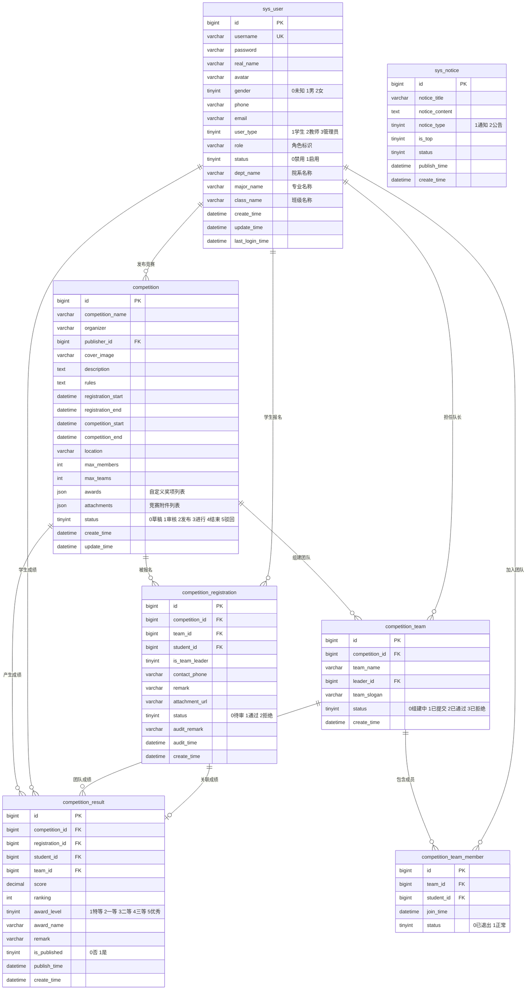

# SCMS 数据库 E-R 图

> 以 `backend/sql/init.sql` 为准。

## 表说明

| 表名 | 用途 |
|------|------|
| `sys_user` | 用户（学生/教师/管理员） |
| `competition` | 竞赛信息 |
| `competition_registration` | 报名记录 |
| `competition_result` | 成绩记录 |
| `competition_team` | 团队 |
| `competition_team_member` | 团队成员 |
| `sys_notice` | 系统公告 |
