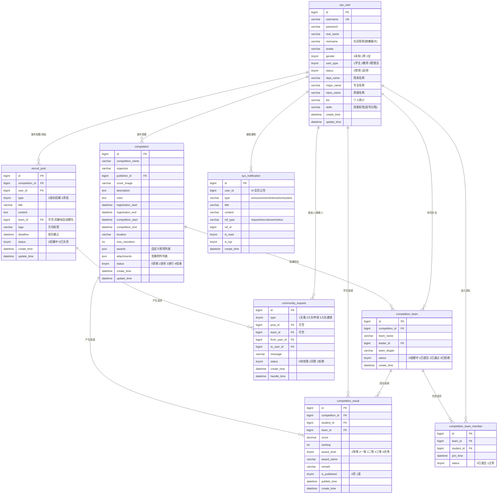

# 赛友 TeamUp 数据库 E-R 图（原 SCMS，2026-09-05 社区化 + Lean 精简）

> 以 `backend/sql/init.sql` 为准。

> 隐私规则：招募帖/请求列表仅返回脱敏资料卡（昵称打码/头像/院系/专业/技能/简介摘要）；`type=1 且 status=1` 的 community_request 表示双方互看解锁，解锁后 `GET /user/public/{id}` 才返回真实姓名、完整简介与已发布获奖记录；手机号/邮箱永不在社区展示。

## 表说明

| 表名 | 用途 |
|------|------|
| `sys_user` | 用户（学生/教师/管理员） |
| `competition` | 竞赛信息 |
| `competition_result` | 成绩记录 |
| `competition_team` | 团队 |
| `competition_team_member` | 团队成员 |
| `recruit_post` | 组队招募/求组帖 |
| `community_request` | 社区请求（资料互看/入队申请/入队邀请） |
| `sys_notification` | 站内通知（含全员公告，替代原 sys_notice） |
