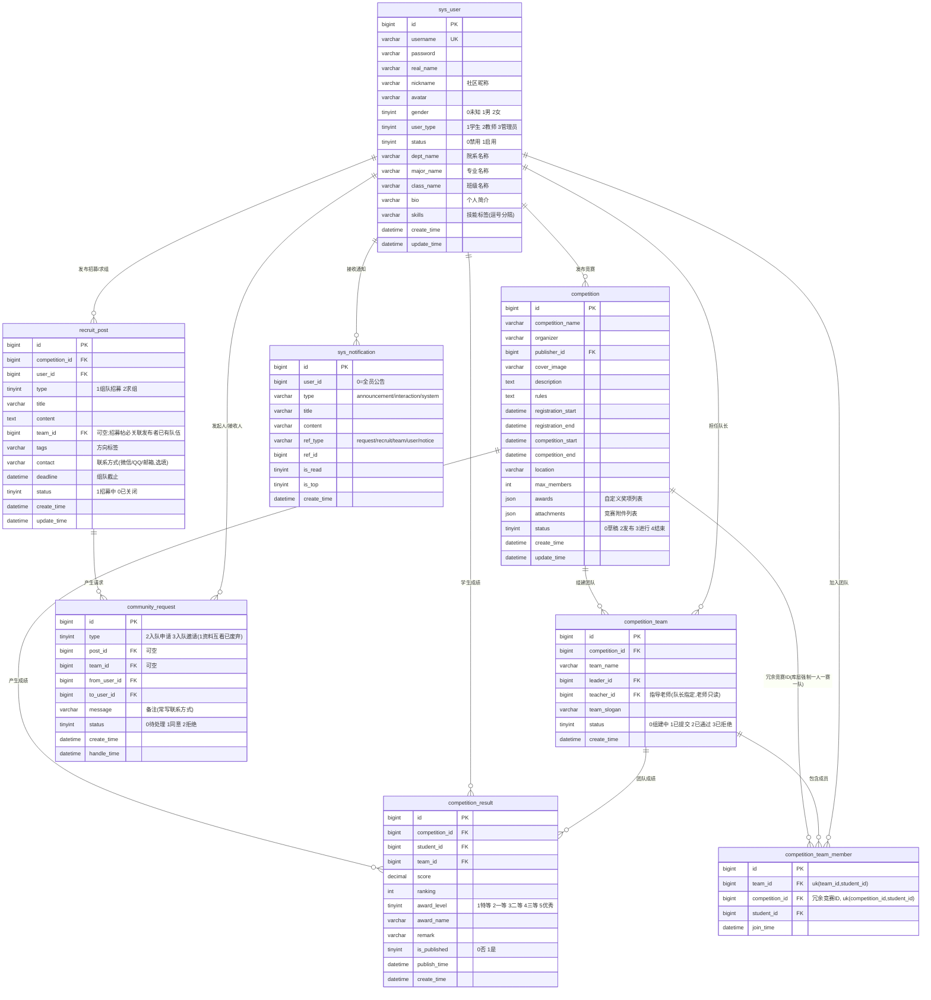

# 赛友 TeamUp 数据库 E-R 图（原 SCMS，2026-09-05 社区化 + Lean 精简；2026-09-09 组队 2.0）

> 以 `backend/sql/init.sql` 为准（含 `upgrade-teamup2.sql` 对应变更：成员表冗余竞赛ID + 双唯一键、招募帖联系方式、资料互看下线）。

> **资料可见性（2026-09 组队 2.0 起）**：原"资料互看解锁"机制已下线——社区资料卡与 `GET /user/public/{id}` 的完整资料（真实姓名、完整简介、已发布获奖记录、参赛统计）对**所有登录用户**开放；展示名优先昵称、无昵称用真实姓名（不再打码）。想私聊沟通的用户在招募帖 `contact` 字段（选填）或申请/邀请备注（`message`）中自行留联系方式。手机号、邮箱等隐私字段始终不入库、不外露。
>
> **队伍规则要点**：提交审核后名单冻结（不可退队/移除成员，驳回后可调整）；`uk_tm_comp_student` 在库层兜底"一人一赛一队"；建队/入队/发申请邀请均校验竞赛报名窗口（`registration_start/end`，空值放行兼容旧数据）；队伍提交审核、审核通过或解散时自动下架关联招募帖。

## 表说明

| 表名 | 用途 |
|------|------|
| `sys_user` | 用户（学生/教师/管理员） |
| `competition` | 竞赛信息 |
| `competition_result` | 成绩记录 |
| `competition_team` | 团队 |
| `competition_team_member` | 团队成员（冗余竞赛ID + 双唯一键） |
| `recruit_post` | 组队招募/求组帖（含联系方式） |
| `community_request` | 社区请求（入队申请/入队邀请；互看类型已废弃仅存历史） |
| `sys_notification` | 站内通知（含全员公告，替代原 sys_notice） |
