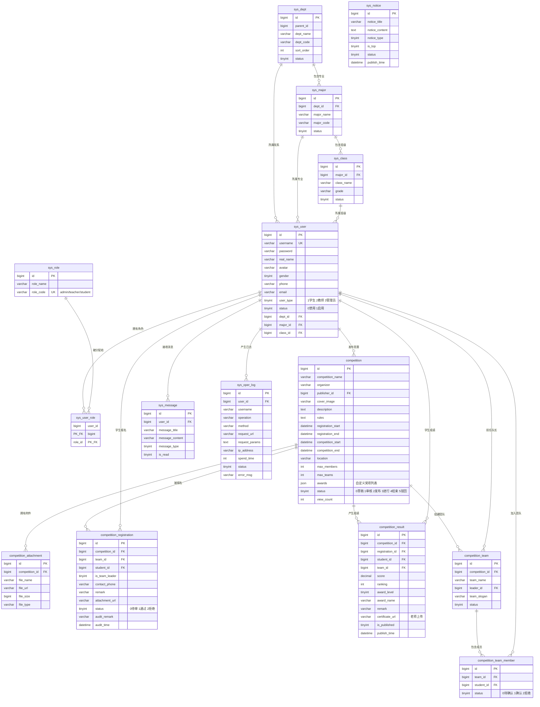

# SCMS 数据库 E-R 图

## 表说明

| 表名 | 用途 | 记录数 |
|------|------|--------|
| `sys_user` | 用户（学生/教师/管理员） | 8 |
| `sys_role` | 角色定义 | 3 |
| `sys_user_role` | 用户-角色关联 | 8 |
| `sys_dept` | 院系 | - |
| `sys_major` | 专业 | - |
| `sys_class` | 班级 | - |
| `competition` | 竞赛信息 | 6 |
| `competition_attachment` | 竞赛附件 | - |
| `competition_registration` | 报名记录 | - |
| `competition_result` | 成绩记录 | - |
| `competition_team` | 团队 | - |
| `competition_team_member` | 团队成员 | - |
| `sys_message` | 站内消息 | - |
| `sys_notice` | 系统公告 | - |
| `sys_oper_log` | 操作日志 | - |
